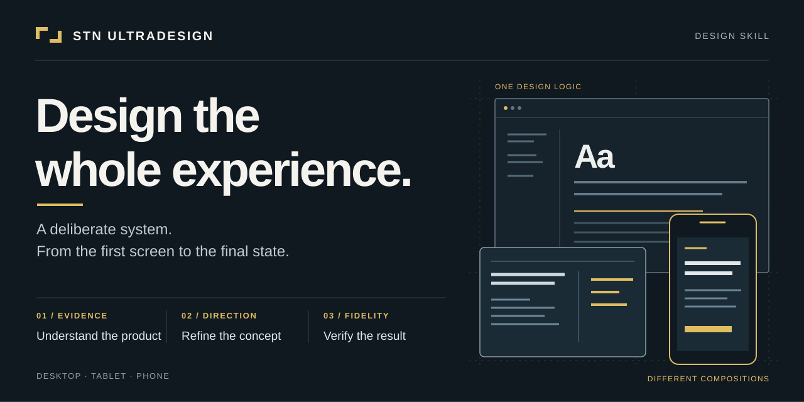
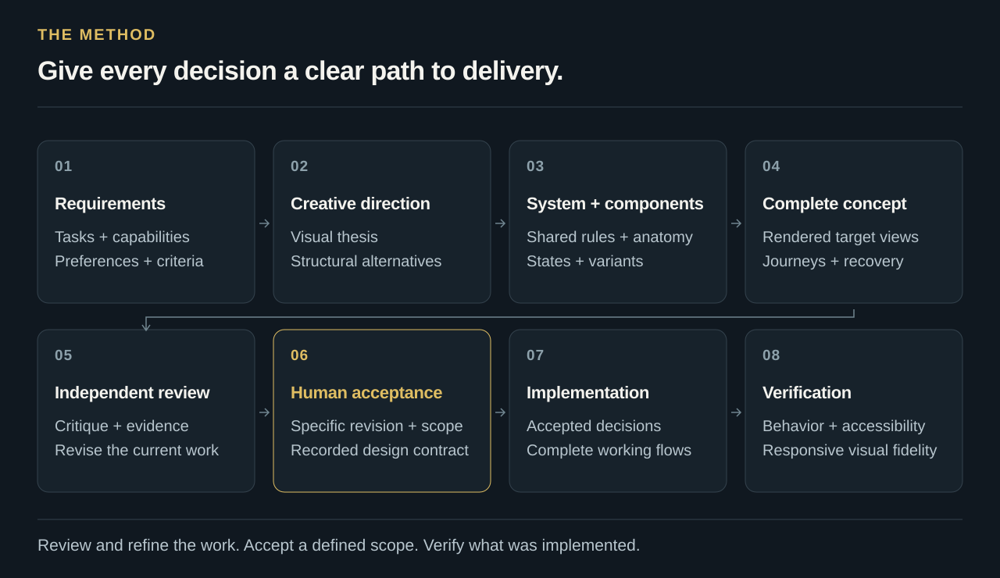

# STN Ultradesign

<p>
<picture>
  <source media="(max-width: 1000px)" srcset="assets/brand/hero-compact-96e85ec366.svg">
  
</picture>
</p>

**A design skill that turns product requirements into a distinctive, complete experience — from creative direction to verified implementation.**

STN Ultradesign guides coding agents through UI/UX audits, design systems, interactive concepts and frontend implementation. It connects visual craft to real tasks: what people need to understand, what they can do next, and how the product behaves through loading, editing, failure, recovery and completion.

Use it with an existing application, a new product or one focused workflow. Bring your brand, preferences and constraints. The skill adapts to desktop, tablet and phone, and follows the language of your request.

[**Get started →**](docs/installation.md) · [Workflow](skills/stn-ultradesign/references/delivery-workflow.md) · [Read the skill](skills/stn-ultradesign/SKILL.md) · [Privacy](PRIVACY.md)

Release **v0.5.1** · [MIT license](LICENSE) · Codex + Claude Code

[](https://github.com/sthiermann/stn-ultradesign/actions/workflows/validate.yml)

## A complete path from requirements to delivery

<p>
<picture>
  <source media="(max-width: 1000px)" srcset="assets/brand/method-compact-7a9eedb6d7.svg">
  
</picture>
</p>

Substantial concept, design-system and redesign work follows a connected sequence. Each stage produces decisions that the next stage can use and check.

| Stage | What you receive |
| --- | --- |
| **1. Requirements** | A traceable record connecting your requests, preferences and product constraints to affected capabilities and observable acceptance criteria. |
| **2. Creative direction** | A researched interpretation of your chosen identity, a product-specific visual thesis and structural alternatives where the direction remains open. |
| **3. System & components** | Shared visual and interaction rules, demonstrated with demanding content, open controls and relevant states before the pattern expands. |
| **4. Complete concept** | A rendered, reviewable experience covering the agreed views, core journeys, device sizes, difficult content and recovery paths. |
| **5. Independent review** | A separate critical review of requirements, visual craft, usability, consistency, preserved capabilities and available evidence. Findings feed into revision. |
| **6. Human acceptance** | Your acceptance of a specific concept revision, scope, decisions and known gaps, recorded in a design contract. |
| **7. Implementation** | Frontend changes traced to accepted layouts, components, behavior and acceptance criteria. |
| **8. Verification** | Observed checks of behavior, accessibility, responsiveness and visual fidelity, with remaining gaps stated plainly. |

The [delivery workflow](skills/stn-ultradesign/references/delivery-workflow.md) makes those handoffs explicit. Existing acceptance remains valid for its agreed scope. An explicit request to implement directly takes precedence. Focused fixes use proportionate checks; audit-only work delivers findings and coverage without requiring a concept or implying approval to redesign.

## Choose the starting point

| Your task | The skill's focus |
| --- | --- |
| **Audit the entire frontend** | Reconcile the inventory, inspect all usages and journeys in scope, prioritize findings and preserve unresolved coverage as gaps. |
| **Develop a design concept** | Establish requirements and preferences, explore a direction, build the component system, render the concept and refine it through review. |
| **Build or evolve a design system** | Translate the product's identity and tasks into coherent tokens, components, states and usage rules. |
| **Implement an accepted concept** | Preserve the agreed decisions and capabilities, then verify the implemented result. |
| **Improve one component or flow** | Trace affected usages and dependencies, make the bounded change and check its consequences. |

## Your product defines the direction

A monitoring workspace needs useful image coverage and fast exception detection. An editor needs room to work. An administrative change needs clear consequences and recovery. The skill establishes the main task, meaningful unit of work and operating conditions before allocating screen space.

Substantial concept work begins with **at least 20 meaningful preference questions** tailored to the product. Confirmed answers carry forward; ask more when an unresolved decision materially affects the outcome. The brief covers character, density, hierarchy, typography, color, shape, motion and device behavior. It distinguishes user preference from product constraints and applicable standards.

Existing identity becomes a deliberate input. Decide what to preserve, evolve or replace across typography, palette, shapes, icons, imagery, voice, layout, motion and materials. Those boundaries carry into the component system and design contract. See [discovery and preferences](skills/stn-ultradesign/references/discovery-and-preferences.md) and [brand discovery](skills/stn-ultradesign/references/brand-discovery.md).

## Your requirements stay connected to the result

Every consequential request follows a traceable path: **your intent → a scoped decision → affected components and journeys → observable checks → current evidence**. A requirement can be recorded without being satisfied. The skill keeps concept coverage, implemented behavior and verified outcomes distinct.

When you choose a design language, the skill investigates its relevant platform and generation, component families, visual rules and interactions. It records what was read, visually inspected or actually exercised, then translates those findings into project-specific rules. Difficult examples test the interpretation before it spreads. Final review follows every affected usage in the agreed scope.

Changing a decision reopens the checks that depend on it. Existing answers remain valid elsewhere. Missing evidence, untested behavior and proposed exceptions stay visible; a broad approval or a successful code check cannot silently close them. Concrete reference research stays with your project, outside this reusable package.

Explore [requirements and conformance](skills/stn-ultradesign/references/requirements-conformance.md) and [reference research](skills/stn-ultradesign/references/project-research.md).

## Visual craft belongs in the system

A coherent experience needs more than attractive isolated screens. The skill connects composition, hierarchy, rhythm and density to the user's next decision. Where a structural decision remains open, alternatives use the same task and content so their consequences are visible.

Buttons, fields, selectors, switches, menus, badges, messages and icons receive a consistent anatomy and the states their tasks require. Focus, hover, selection, pending work, errors and state combinations must remain understandable. Shared rules connect surfaces without forcing a dense workspace, a permissions editor and an API reference into the same layout.

Rendered concepts are inspected at relevant sizes with difficult content. Visual criticism and revision remain part of the work; an automated check does not establish aesthetic acceptance. See [visual systems](skills/stn-ultradesign/references/visual-systems.md) and [component states](skills/stn-ultradesign/references/component-states.md).

## Complete tasks, preserve capabilities

Every critical task needs a discoverable path from entry to useful action, object and context, outcome and return. Opening a detail should preserve enough context to resume the work. Navigation, local views, commands and independent overlays have different jobs and receive appropriate interactions.

A redesign maintains an **old → new feature map**. It accounts for affected capabilities, role access, behavior, states and destinations, including toolbar overflow, object menus, edit modes, saved preferences and simultaneous panels. Moving a capability requires a usable new home; dropping one requires an agreed scope change.

Existing themes, supported languages, density options, charts and graph types remain part of that mapping. A full-product redesign covers every discovered capability. A focused change covers its requested scope plus affected shared usages and dependencies. See [task-flow design](skills/stn-ultradesign/references/task-flow-design.md) and [feature preservation](skills/stn-ultradesign/references/feature-parity.md).

## Make data understandable and actionable

For dashboards, tables, charts and widgets, the skill examines what each value means: definition, unit, population, timeframe, aggregation, comparison and freshness. Missing data must remain distinguishable from zero. Status colors need an explainable rule.

Review follows the connection from a headline to its chart, filtered records, linked detail and return path. Filters, comparisons, explanations and drilldowns should help people make the actual decision. Uncertain domain meaning stays explicit and becomes a focused question. See [analytical meaning](skills/stn-ultradesign/references/analytical-meaning.md).

## Evidence you can follow

A full audit covers every discovered page, component usage, widget, dialog, drilldown and defined relevant workflow, state and transition in scope. Large products are covered in resumable batches. Inaccessible areas stay visible as gaps; sampling requires an agreed scope change.

The package includes templates for requirements, briefs, reference translation, feature maps, task flows, design contracts and audit evidence. Its local Python coverage validator checks the consistency of a declared audit inventory, obligations and evidence. It does not evaluate the requirement register, inspect the application or certify discovery completeness, design quality or security.

Independent review challenges the current artifact against the requirements and design intent. It uses a separate reviewer when the host supports one; otherwise, self-review is identified as such and the limitation remains explicit. Human acceptance records the revision and scope that may proceed. Verification then checks the implementation itself. See [verification](skills/stn-ultradesign/references/verification.md).

## Put it to work

Install the [Codex skill or Claude Code plugin](docs/installation.md), open the application project and start a new task. Choose the example that matches your intended scope. For a fresh review, follow the [new design review instructions](docs/installation.md#start-a-new-design-review); previous concepts do not need to be deleted.

**Audit an existing application and develop its redesign**

```text
$stn-ultradesign Audit the entire frontend of this existing application
using its current source code and running interface. Ask me about
my requirements and design preferences, preserve existing capabilities,
and develop a complete interactive design concept. Clarify which
earlier design decisions still apply. Independently review and refine
the concept with me. Implement production changes only after my approval.
```

**Audit only**

```text
$stn-ultradesign Audit the entire frontend. Inventory every page,
component usage, widget, drilldown, workflow and relevant state.
Prioritize findings with evidence and preserve unresolved coverage as gaps.
```

**Develop a complete design concept**

```text
$stn-ultradesign Develop a design concept for this application.
Clarify requirements and preferences, establish a creative direction,
build the system and components, and render the complete concept.
Have it independently reviewed, refine it with me, and obtain my
acceptance of the specific scope before production implementation.
```

**Implement an accepted design**

```text
$stn-ultradesign Implement the accepted concept. Trace the changes to
its design decisions and verify behavior, accessibility and visual fidelity.
```

In Claude Code, use `/stn-ultradesign:stn-ultradesign` after plugin installation, or `/stn-ultradesign` for an individual skill installation. Public package documentation is English.

## Package and privacy

The package contains the skill, its reusable references and templates, local validators, automated checks and installation metadata. It configures no hooks, telemetry, MCP servers or external services. Original instructions and SVG artwork are covered by the [MIT License](LICENSE).

Account, access, messaging and administrative reviews examine interfaces and user journeys. Use an already authenticated session, user-completed sign-in or authorized test data. An audit does not authorize collecting secrets, changing real permissions or sending messages. Project-specific evidence stays with the user's project. See [privacy and audit scope](PRIVACY.md).

Created by [Sven Thiermann](https://github.com/sthiermann). [Contributing](CONTRIBUTING.md).
