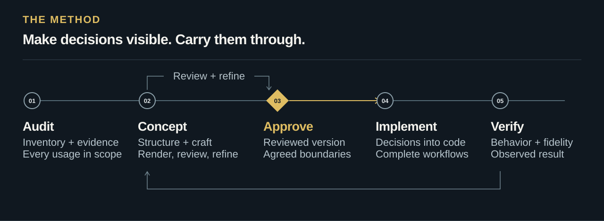

# STN Ultradesign

<p>
<picture>
  <source media="(max-width: 1000px)" srcset="assets/brand/hero-compact-96e85ec366.svg">
  
</picture>
</p>

**A design skill for the entire product: visual craft, complete workflows, and implementation you can verify.**

STN Ultradesign helps coding agents examine existing interfaces, develop distinctive design concepts, and carry approved decisions into HTML, CSS, and React. It connects the composition of a screen to the task behind it — and follows that task through loading, editing, failure, recovery, and completion.

Built for desktop, tablet, and phone. Grounded in primary design sources. Organized around your product's users, language, and existing identity.

[**Get started →**](docs/installation.md) · [Read the skill](skills/stn-ultradesign/SKILL.md) · [Method](skills/stn-ultradesign/references/feature-parity.md) · [Evaluation](docs/quality/evaluation.md) · [Privacy](PRIVACY.md)

Release **v0.3.0** · [MIT license](LICENSE) · Codex + Claude Code

[](https://github.com/sthiermann/stn-ultradesign/actions/workflows/validate.yml)

## From evidence to a coherent experience

<p>
<picture>
  <source media="(max-width: 1000px)" srcset="assets/brand/method-compact-0447f25be4.svg">
  
</picture>
</p>

For substantial design work, the default is **concept → refinement → your approval → implementation**. Approval applies to specific views, states, and decisions. Existing approval remains valid for that scope; an explicit request to implement directly takes precedence. Audit-only work produces findings without silently authorizing a redesign.

| Start with… | Receive… |
| --- | --- |
| **A complete frontend audit** | A reconciled inventory, prioritized findings, supporting evidence, and a resumable coverage record. |
| **A new design direction** | A preference brief, a product-specific visual thesis, meaningful structural alternatives, rendered concepts, and decisions ready for review. |
| **An approved concept** | An implementation traced to the agreed layout, components, behavior, and acceptance criteria. |
| **One focused improvement** | A proportionate review and change to the requested component or workflow. |

## The application’s purpose comes first

A monitoring grid needs useful image coverage and fast exception detection. An editor needs room to work. An administrative change needs understandable consequences and recovery. The skill establishes the primary task, meaningful unit of work, operating conditions, and observable success criteria before allocating screen space. Every persistent region must justify the attention and space it consumes.

## Understand the numbers. Make the next step clear.

A dashboard is useful only when people understand what its numbers mean and what they can do next. The skill examines the definition, unit, population, timeframe, aggregation, comparison, and freshness behind each relevant metric, table, chart, and widget. A missing value must not masquerade as zero; a red status needs a defensible business rule.

Three connected passes examine **meaning → exploration and action → consistency across views**. Follow a headline into its chart, filtered records, linked detail, and return path. Identify useful missing filters, comparisons, explanations, or drilldowns, while preserving what already works. Recommendations explain their evidence, dependencies, and tradeoffs; a familiar industry pattern is not automatically right for every application.

The audit asks you focused questions whenever domain meaning or direction remains uncertain, with no fixed question ceiling. Previously confirmed answers carry forward. See the [analytical meaning method](skills/stn-ultradesign/references/analytical-meaning.md), [surface record](skills/stn-ultradesign/assets/analytical-surface.template.md).

## Less searching. More useful work.

Minimalism should make work easier to find. Every critical task follows a visible path: **entry → useful action → object and context → evidence → outcome → return**. A camera event should lead to the right camera and moment. A live chart should explain its scope, units and freshness. Closing a detail should restore the work you left.

The skill tests those paths in the rendered concept before calling them ready. It separates product navigation from local views and commands, checks compact layouts without piling up desktop navigation, and keeps required actions discoverable. A missing workflow stays unfinished even when its button looks polished. Feedback becomes a concrete change with an acceptance condition and fresh evidence. See the [task-flow method](skills/stn-ultradesign/references/task-flow-design.md).

## Craft is part of the method

An attractive component does not make a coherent product. STN Ultradesign asks what deserves attention, which relationships should be visible, and how composition supports the next decision.

- **Start with the domain.** Establish the main task, information hierarchy, constraints, and visual thesis before choosing the treatment.
- **Compare structure.** Explore materially different arrangements using the same task and content. A new accent color is not a new concept.
- **Give each surface a purpose.** A monitoring workspace, a permissions editor, and an API reference need different compositions. Shared tokens connect them.
- **Inspect what actually renders.** Examine target sizes, difficult content, and relevant states. Critique typography, density, alignment, rhythm, and interaction; then revise.
- **Keep two judgments separate.** Functional checks establish behavior. Visual review and user feedback establish whether the design meets the intended standard. Rejected concepts stay open.

Existing brand and platform conventions are inputs to a deliberate design decision. Recommendations explain whether they follow an applicable standard, an established usability practice, a product constraint, or a matter of taste.

## Every control deserves a complete design

A field is more than its resting outline. The skill defines the anatomy and meaningful states of buttons, selectors, checkboxes, radios, switches, menus, badges, messages, and icons. Hover, keyboard focus, press, selection, pending work, and errors each need a distinct, coherent treatment — including the combinations that occur in real tasks.

Your brand guides that treatment. Prominent translucent materials, precise technical surfaces, or a quieter visual language become explicit component decisions. The skill researches whichever design language you choose and translates its relationships into your product. Historical vendor studies are optional evidence, not built-in style presets. See the [component state method](skills/stn-ultradesign/references/component-states.md) and [reference translation workflow](skills/stn-ultradesign/references/brand-discovery.md#research-the-selected-language-for-this-project).

## Your preferences before the first concept

Substantial concept work starts with a structured brief of **at least 20 meaningful preference questions** tailored to the product. This is a minimum, not a ceiling: ask more when an unresolved decision materially affects the outcome. Previously confirmed answers carry forward. Establish the intended character, information density, layout priorities, typography, color, shape, motion, device behavior, and what already works for you. The brief makes the difference between established best practice and aesthetic preference clear, so you can make informed choices.

Those answers become design inputs and acceptance criteria. Each accepted rule is traced to its affected component usages and relevant states, with rendered evidence or an explicit gap. Separate review passes examine complete tasks, visual consistency, redundant information and device/input behavior; corrections are checked again on the latest artifact. Reviewable alternatives then show their consequences in the actual product. See the [discovery and preference method](skills/stn-ultradesign/references/discovery-and-preferences.md).

## Your brand, deliberately carried forward

Bring your company guidelines, existing design system, or approved reference materials. The skill establishes what is binding and asks **how much to inherit in each dimension**: typography, colors, shapes, icons, imagery, voice, layout, motion, and materials.

Preserve the logo and font. Evolve the palette. Reimagine the layout. Or choose another combination: each decision gets a clear boundary in the brand brief and design contract. Asset provenance, theme behavior, and accessible color roles remain explicit. See [brand discovery and selective inheritance](skills/stn-ultradesign/references/brand-discovery.md).

## No silent feature loss

A redesign must account for what the product already does. Build an **old → new feature map** recording location, role access, behavior, states, and proposed destination. A full-product redesign maps every discovered capability. A bounded concept or focused fix maps its requested scope plus all transitively affected shared usages and dependencies. Audit-only work records the current baseline without inventing proposed destinations. A cleaner composition does not authorize dropping a capability.

**Every action needs a home.** Inspect toolbar overflow, object menus, edit modes, independent overlays, saved preferences and supported simultaneous panels. Selecting a view, creating one, arranging its contents and sharing it are different capabilities. The concept must demonstrate where familiar actions moved, what they do and how the user returns. A page name in a checklist does not establish feature coverage. Use the [capability walkthrough](skills/stn-ultradesign/assets/capability-walkthrough.template.md).

Preserve existing **light/dark modes, supported languages, density options, and every chart or graph type**. Moving, merging, or changing a feature must preserve its usable capability or follow an explicitly agreed change. Verify affected capabilities and variants against the mapping before calling the redesign complete; a narrow fix does not require redesigning unrelated areas. See the [feature-parity method](skills/stn-ultradesign/references/feature-parity.md).

Modernity is more than an effect. The [navigation and materials guide](skills/stn-ultradesign/references/navigation-and-materials.md) chooses patterns from task frequency, hierarchy and available space. Visual language is researched for the current project, with readable fallbacks and explicit web implementation limits.

## Coverage beyond the happy path

| Capability | Decisions the skill makes explicit |
| --- | --- |
| **Visual systems** | Layout, hierarchy, type, spacing, color, shape, iconography, motion, and design tokens. |
| **Navigation & materials** | Adaptive hierarchy, sidebars, navigation stacks, list/detail, contextual drawers, user-selected materials, shape, elevation, and purposeful motion. |
| **Adaptive interfaces** | Available space, content, touch, keyboard, pointer, zoom, and user preferences. |
| **Product workflows** | Navigation, forms, wizards, search, filters, settings, editing, pending actions, and recovery. |
| **Messaging** | Conversation discovery, recipient context, composition, supported delivery states, drafts, attention and coexistence with the main workspace. |
| **Account & access UX** | Sign-in and recovery screens, session controls, role explanations, permission states, and the placement of personal versus administrative settings. |
| **Business administration** | Member and invitation journeys, scope, ownership, role changes, and governance where the product actually needs them. |
| **Developer experience** | API-access screens, service-account workflows, webhook configuration, delivery feedback, and readable API documentation. |
| **Data interfaces** | Tables, charts, dashboards, widgets, relationship graphs, missing data, and uncertainty. |
| **Accessible engineering** | Semantic HTML, resilient CSS, React state, performance, focus, keyboard interaction, and verification. |

**A full audit means every discovered page, component usage, widget, dialog, drilldown level, and defined relevant workflow, state, and transition in scope.** Large products are covered in resumable batches. A shared-component check does not replace its usage contexts. Inaccessible areas remain gaps. A reduced sample needs an agreed scope change and cannot close the original full-audit claim.

The included coverage validator checks the consistency of the audit's declared inventory, obligations, and evidence. It does not inspect the application or certify design quality, security, or discovery completeness.

## Put it to work

Install the [Codex skill or Claude Code plugin](docs/installation.md), then describe the work in ordinary language.

**Audit an existing application**

```text
$stn-ultradesign Audit the entire frontend. Inventory every page,
component usage, widget, drilldown, and defined workflow and relevant state.
Prioritize findings with evidence. Preserve unresolved coverage as gaps.
```

**Develop a direction before changing production**

```text
$stn-ultradesign Develop a design concept for this application.
Compare structural alternatives for its main tasks, render the chosen
direction across target sizes, and refine it with me. Wait for my concept
approval before changing the production implementation.
```

**Implement an agreed design**

```text
$stn-ultradesign Implement the approved concept. Trace the changes to
its design decisions and verify behavior, accessibility, and visual fidelity.
```

In Claude Code, use `/stn-ultradesign:stn-ultradesign` after plugin installation, or `/stn-ultradesign` for a standalone skill. The skill follows the language of your request; repository documentation is English.

## Account and access reviews are UX work

This capability examines **interface layout, navigation, explanations, and user workflows**. Use synthetic fixtures, an already authenticated session, or sign-in completed by the user. It does not ask the agent to collect passwords, retrieve tokens, inspect credential stores, or harvest session data.

An audit does not authorize creating or revoking real credentials, changing real permissions, or sending real webhook tests. Evidence should contain the minimum needed to explain a design issue. The package adds no hooks, telemetry, MCP servers, or external services; these are operating instructions, not a technical sandbox. See the [privacy and access boundary](PRIVACY.md).

## Open method. Honest evidence.

The method is independently written and design-language-neutral. It researches the current product and the user’s chosen direction, then turns those findings into explicit decisions and observable checks. Project research stays with that project; this repository contains original instructions, templates, tools and synthetic exercises.

The package includes an audit ledger, a design contract, a local Python validator and synthetic evaluation fixtures. Package checks and coverage tests are automated. Actual client installation, application behavior, user research, and aesthetic acceptance are reported separately in the [evaluation record](docs/quality/evaluation.md).

**Version 0.3.0 is an early release.** There is no validated claim of universal superiority or a fixed percentage improvement. The evaluation record preserves unsuccessful outcomes too, including an early synthetic concept rejected for its visual quality. That feedback informed stronger concept and craft requirements; it is not counted as a passed design evaluation.

## Development priorities

| Available now | Next evidence to establish |
| --- | --- |
| Full-audit inventory and coverage rules | Broader trials on realistic products, including deep administrative workflows. |
| Concept approval and implementation contracts | Repeated, independently reviewed concept-to-code exercises across device sizes. |
| Synthetic fixtures and local consistency checks | Reproducible task outcomes and visual assessments under documented conditions. |
| Original specialist methods and project-specific research | Ongoing review of changing platform guidance and client installation behavior. |

These are development priorities, not promised results or release dates. Improvements should earn their place through clearer decisions and better observed outcomes.

---

Created by [Sven Thiermann](https://github.com/sthiermann). Original project content is released under the [MIT License](LICENSE). [Contribute](CONTRIBUTING.md) · [Copyright and originality](THIRD_PARTY_NOTICES.md)
