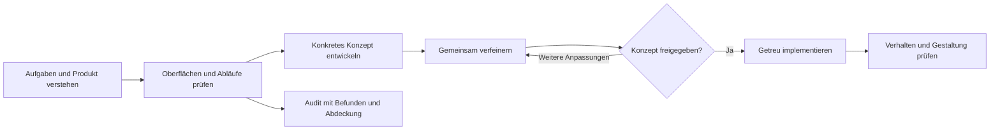

# STN Ultradesign

**Oberflächen verstehen. Konzepte abstimmen. Gestaltung überprüfbar umsetzen.**

STN Ultradesign ist ein eigenständig entwickelter Design-Skill für Codex und Claude Code. Er verbindet UI/UX-Audits, visuelle Gestaltung, vollständige Nutzerabläufe, Barrierefreiheit und HTML/CSS/React-Engineering. Für bestehende Anwendungen ebenso wie für neue Produkte auf Desktop, Tablet und Smartphone.

Das Ziel: Entscheidungen, die sich am Produkt und seinen Nutzern begründen lassen — vom Abstand eines Labels bis zur Wiederaufnahme eines unterbrochenen Workflows.

[Installation](docs/installation.md) · [Skill lesen](skills/stn-ultradesign/SKILL.md) · [Forschungsgrundlage](docs/research/overview.de.md) · [Prüfstand](docs/quality/evaluation.md) · [Quellen](skills/stn-ultradesign/references/sources.md) · [Mitwirken](CONTRIBUTING.md) · [MIT-Lizenz](LICENSE)

## Vom Auftrag zum geprüften Ergebnis



Bei einem neuen Design oder größeren Redesign steht ein überprüfbares Konzept vor der Produktionsumsetzung. Die Freigabe bezieht sich auf konkrete Ansichten, Komponenten, Zustände und Entscheidungen. Bereits erteilte Freigaben bleiben für diesen Umfang gültig. Ein ausdrücklicher Auftrag zur direkten Umsetzung hat Vorrang.

## Vier Arbeitsweisen

| Arbeitsweise | Ergebnis |
| --- | --- |
| **Audit** | Inventar, beobachtete Probleme, Prioritäten, Belege und sichtbare Prüflücken. |
| **Konzept zuerst** | Ansichten und Interaktionen, Alternativen bei relevanten Entscheidungen, gemeinsame Verfeinerung und dokumentierte Freigabe. |
| **Freigegebenes Konzept umsetzen** | Implementierung mit nachvollziehbarer Verbindung zwischen Designentscheidungen, Komponenten und Prüfungen. |
| **Gezielt verbessern** | Eine vereinbarte Komponente, ein Ablauf oder ein konkreter Fehler mit angemessenem Prüfumfang. |

Die Arbeitsweise wird im normalen Auftrag beschrieben. Es sind keine zusätzlichen technischen Unterbefehle erforderlich.

## Was der Skill untersucht

| Bereich | Beispiele |
| --- | --- |
| Produkt und Struktur | Nutzeraufgaben, Informationsarchitektur, Navigation, Inhalt, Rollen und Erfolgskriterien. |
| Visuelles System | Layout, Hierarchie, Abstände, Typografie, Farbe, Formen, Icons, Bewegung und Design-Tokens. |
| Geräte und Eingabe | Anpassung an verfügbare Fläche, Maus, Tastatur, Touch, Zoom und Nutzereinstellungen. |
| Komponenten und Abläufe | Formulare, Dialoge, Wizards, Suche, Filter, Einstellungen, Bearbeitung und Rückmeldungen. |
| Identität und Berechtigungen | Anmeldung, Sitzungen, Wiederherstellung, Rollen, Organisationen und verweigerter Zugriff. |
| Datenoberflächen | Tabellen, Diagramme, Dashboards, Widgets und Beziehungsgraphen einschließlich Datenqualität. |
| Business-Verwaltung | Persönliche, Organisations- und Projekteinstellungen; Mitglieder, Einladungen, Rollen, Verantwortlichkeiten und Zugriffsgrenzen, soweit im Produkt vorhanden. |
| Entwicklerzugriff | Persönliche und technische API-Tokens, Service Accounts, Webhooks, Zustellungen und verständliche OpenAPI-Dokumentation. |
| Umsetzung | Semantisches HTML, belastbares CSS, React-Zustände, Komponenten und Performance. |
| Verifikation | Visuelle Übereinstimmung, kritische Aufgaben, Tastaturbedienung, Barrierefreiheit und Fehlerzustände. |

**Ein vollständiger Audit umfasst jede Seite, jede Komponentenverwendung, jedes Widget, jede Drilldown-Ebene und sämtliche definierten relevanten Workflows, Zustände und Übergänge.** Große Anwendungen werden in fortsetzbaren Etappen geprüft. Nicht erreichbare Bereiche bleiben als offene Lücken sichtbar. Repräsentative Seiten ersetzen keinen vollständigen Audit; eine Stichprobe setzt eine ausdrücklich vereinbarte Änderung des Umfangs voraus. Ein Screenshot gilt nicht als Nachweis für funktionierende Interaktion oder sichere Autorisierung.

## Direkt loslegen

Nach der [Installation](docs/installation.md) in Codex:

```text
$stn-ultradesign Auditiere das gesamte Frontend. Erfasse jede Seite,
Komponentenverwendung, jedes Widget und jede Drilldown-Ebene sowie alle
definierten Workflows und relevanten Zustände. Liefere priorisierte Befunde
mit Belegen und vollständiger, fortsetzbarer Prüfabdeckung.
```

```text
$stn-ultradesign Entwickle ein neues Designkonzept für diese Anwendung.
Zeige die wichtigsten Ansichten für Desktop, Tablet und Smartphone.
Verfeinere das Konzept mit mir und warte vor der Produktionsumsetzung
auf meine Freigabe.
```

```text
$stn-ultradesign Setze das freigegebene Konzept um. Ordne die Änderungen
den vereinbarten Designentscheidungen zu und prüfe Verhalten, Barrierefreiheit
und visuelle Übereinstimmung.
```

In Claude Code heißt derselbe Skill nach Plugin-Installation
`/stn-ultradesign:stn-ultradesign`. Bei Installation als einzelner Claude-Skill
lautet der Aufruf `/stn-ultradesign`.

## Nachvollziehbare Entscheidungen

Der Skill unterscheidet Standards, Herstellerempfehlungen, Forschung, Heuristiken und eigene Produktentscheidungen. Markenidentität und vorhandene Komponenten zählen genauso wie neue Möglichkeiten der Plattformen. Die Referenzen werden passend zur Aufgabe geladen; sie sollen konkrete Entscheidungen unterstützen.

Zum Paket gehören eine Audit-Vorlage, ein Prüfer für deren Konsistenz und Abdeckung sowie eine Vorlage für den Designvertrag. Der Prüfer untersucht die Dokumentation des Audits. Er bewertet nicht automatisch die Qualität einer Anwendung.

**Version 0.1.0** ist die erste Version dieses Verfahrens. Eine universelle Überlegenheit oder eine Verbesserung um einen festen Prozentsatz ist nicht nachgewiesen. Aussagen über tatsächliche Qualität brauchen reproduzierbare Aufgaben, Vergleichsbedingungen und Ergebnismessungen. Das [Evaluationsverfahren](skills/stn-ultradesign/references/skill-evaluation.md) beschreibt, wie solche Vergleiche durchgeführt werden können.

## Inhalt und Voraussetzungen

Ein Skill mit thematischen Referenzen, eigenen Vorlagen und einem lokalen Python-Prüfer. Die Plugin-Manifeste konfigurieren keine Hooks, MCP-Server oder externen Dienste. Für die Arbeit an einer Anwendung nutzt der Agent die im jeweiligen Projekt vorhandenen Werkzeuge und Berechtigungen; Browserzugriff und geeignete Testdaten verbessern die Prüftiefe. Python 3 wird nur für den optionalen Audit-Prüfer benötigt.

Die Dokumentation richtet sich auf Deutsch an Anwender. Die operativen Skill-Anweisungen sind auf Englisch verfasst; der Skill soll in der Sprache des jeweiligen Auftrags kommunizieren.

Quellen und Installationshinweise: geprüft am **16. September 2026**. Veränderliche Plattformregeln und APIs müssen bei ihrer Anwendung erneut geprüft werden. Hinweise zu Urheberschaft und externen Quellen stehen in [THIRD_PARTY_NOTICES.md](THIRD_PARTY_NOTICES.md).
