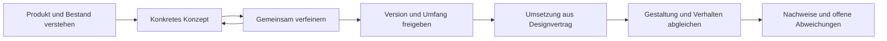

# stn-ultradesign: Forschungsgrundlage und Designanspruch

Stand: **16. September 2026**. Das Ergebnis ist ein eigenständig entwickeltes Skill für umfassende UI/UX-Audits, gemeinsame Konzeptentwicklung und nachvollziehbare Umsetzung. Es verbindet visuelle Gestaltung, Produktabläufe, Business-Verwaltung, Webtechnik und Prüfung. Die Quellen sind in den Fachberichten und im [Quellenverzeichnis des Skills](../../skills/stn-ultradesign/references/sources.md) verlinkt.

## 1. Was ausgezeichnetes, modernes Design ausmacht

Ein hochwertiges Produkt hilft seinen tatsächlichen Nutzern, ihre Aufgaben verständlich, zügig und zuverlässig zu erledigen. Dazu gehören eine bewusst gestaltete Oberfläche und die weniger sichtbaren Entscheidungen: Berechtigungen, Datenzustände, Wiederaufnahme, Fehlerkorrektur, mobile Eingabe, fachliche Genauigkeit und Leistung unter realistischen Bedingungen.

„Modern“ hat deshalb mehrere Dimensionen: zeitgemäße technische Möglichkeiten, passende Plattformkonventionen, ausgereifte Nutzerabläufe, gute Zugänglichkeit und eine eigenständige visuelle Sprache. Das Erscheinungsjahr einer Optik reicht als Qualitätsbeleg nicht aus. Eine neue Materialwirkung kann zu einem Produkt passen und in einem anderen Kontext Lesbarkeit oder Aufmerksamkeit verschlechtern.

Der Anspruch dieses Projekts ist sehr hoch. Eine Behauptung wie „weltweit bestes Skill“, „100-mal besser“ oder „5000 % Verbesserung“ wäre jedoch erst mit definierten Vergleichsaufgaben und belastbaren Ergebnissen sinnvoll. Der [Evaluationsplan](../../skills/stn-ultradesign/references/skill-evaluation.md) legt fest, wie sich konkrete Vorteile überprüfen lassen. Die gelieferte Fassung dokumentiert ihre tatsächlichen Tests getrennt von noch ausstehenden Vergleichs- und Nutzerstudien.

## 2. Welche Quellen welche Autorität besitzen

| Quellenart | Nutzen | Grenze |
| --- | --- | --- |
| Normative Spezifikationen | Prüffähige Anforderungen und definierte Begriffe | Geltungsbereich und Ausnahmen müssen stimmen |
| Offizielle Implementierungsdokumentation | Tatsächliche API-, Browser- und Bibliotheksfähigkeiten | Versionsabhängig; korrekte Nutzung bleibt erforderlich |
| Hersteller-Designsysteme | Ausgereifte Bausteine und nachvollziehbare Gestaltungslogik | Auf die jeweiligen Produkte und Plattformen zugeschnitten |
| Originalforschung und Fachautoren | Erklärungsmodelle, Untersuchungen, bewährte Heuristiken | Nicht jede Faustregel ist experimentell oder universell bestätigt |
| Produktdokumentation großer Anbieter | Konkrete Rollen, Lebenszyklen und Verwaltungsabläufe | Anbieter können unterschiedliche, gleichermaßen begründete Modelle haben |
| Öffentliche Skills und Demos | Marktvergleich von beschriebenen Fähigkeiten | Umfang, Popularität und schöne Beispiele beweisen keine Überlegenheit |

Diese Ebenen werden im Skill ausdrücklich getrennt. Beispielsweise ist WCAG 2.2 eine W3C Recommendation; ARIA-Beispiele sind Implementierungshilfen; ein Systemraster von IBM ist eine Herstellerentscheidung. Die eigene Methode ergänzt dazu prüfbare Arbeitsanweisungen. [WCAG](https://www.w3.org/TR/WCAG22/), [ARIA APG](https://www.w3.org/WAI/ARIA/apg/practices/read-me-first/), [Carbon Grid](https://carbondesignsystem.com/elements/2x-grid/overview/)

## 3. Die untersuchten Designtraditionen

Die Recherche kombiniert offen zugängliche Originalveröffentlichungen international einflussreicher Personen. Die Auswahl ist keine Rangliste und behauptet nicht, deren vollständiges Werk gelesen zu haben.

| Perspektive | Einbezogene Autoren | Übertragung in unsere Arbeit |
| --- | --- | --- |
| Menschen, Aufgaben und Interaktion | Don Norman, Eli Spencer, Jakob Nielsen, Ben Shneiderman, Bruce Tognazzini | Aufgabenverständnis, Status, Kontrolle, Fehlertoleranz und konkrete Beobachtung |
| Gestalterische Sorgfalt | Dieter Rams | Nützlichkeit, Verständlichkeit und bewusst begründete Gestaltung |
| Mobile Nutzung und Eingabe | Luke Wroblewski, Josh Clark | Priorisierung, Gerätesituation, Eingabe und bequeme Erreichbarkeit |
| Systeme und Produktentwicklung | Brad Frost, Julie Zhuo | Zusammenhängende Komponenten, reale Inhalte und überprüfbare Prototypen |
| Daten und analytisches Denken | Tamara Munzner, Edward Tufte, Stephen Few, Mike Bostock | Fachliche Fragen, Darstellungswahl, Vergleich und Implementierung |

Die einzelnen Aussagen, Originalquellen und Lesegrenzen stehen im [Expertenbericht](experts.md). Aus dieser Kombination entsteht keine feste Ästhetik. Ein Labor-Dashboard, ein Verwaltungsportal und eine kulturelle Publikumsanwendung müssen nicht gleich aussehen.

## 4. Was wir aus den großen Designsystemen ableiten

Untersucht wurden Apple HIG, Material/Android, Microsoft Fluent, IBM Carbon, Adobe Spectrum, Atlassian, Salesforce SLDS, Shopify Polaris, AWS Cloudscape und Ant Design. Der [Plattformbericht](platforms.md) dokumentiert 27 Quellen samt Abrufstatus; einige dynamische Herstellerseiten waren nur über ihren offiziellen Suchindexinhalt lesbar.

Die wesentliche eigene Synthese lautet:

- **Layout folgt Aufgaben und verfügbarem Platz.** Zusätzlich zur Fensterbreite zählen Textgröße, Eingabe, Mehrfensterbetrieb, Inhalt und Arbeitsdichte.
- **Hierarchie ist eine Beziehung.** Typografie, Abstände, Gruppierung, Farbe, Fläche und Bewegung sollten dieselbe Priorisierung vermitteln.
- **Designregeln werden als System beschrieben.** Rollen für Texte, Farben, Abstände, Formen, Zustände und Komponenten müssen zusammenpassen.
- **Markencharakter und vertraute Bedienung können koexistieren.** Eine charaktervolle Oberfläche braucht keine neu erfundene Bedienlogik für jede Standardaufgabe.
- **Anpassung erhält Arbeit.** Beim Wechsel von Layout oder Gerät dürfen wichtige Informationen, Zustände und Aufgabenfortschritt nicht beiläufig verloren gehen.
- **Trends brauchen technische und fachliche Eignung.** Die Ankündigung einer Gestaltungssprache beweist nicht, dass jede Bibliothek deren Komponenten stabil unterstützt.

Das Skill schreibt deshalb weder eine universelle Schriftfamilie noch ein einziges Raster, eine globale Rundung oder ein pauschales Verbot bestimmter Farben vor. Stattdessen verlangt es eine begründete Richtung und überprüft ihre Ausführung.

## 5. Konto, Organisation, Rollen und Entwickleroberflächen

Dieser Bereich ist ein eigener Schwerpunkt. Ein Business-Produkt besteht häufig aus mehreren überlagerten Geltungsbereichen: persönliches Konto, Organisation, Projekt, Ressource, Umgebung und gegebenenfalls Kunde oder Mandant. Welche davon tatsächlich existieren, wird aus dem jeweiligen Produkt ermittelt; ein kleines Einzelplatzwerkzeug braucht keine künstliche Unternehmensverwaltung.

Das Skill prüft insbesondere:

| Bereich | Fragen an die konkrete Anwendung |
| --- | --- |
| Persönliche Einstellungen | Wirkt eine Änderung nur für mich? Wo liegen Profil, Benachrichtigungen, Sprache und eigene Anmeldung? |
| Organisationsverwaltung | Wer kann Mitglieder einladen, Rollen ändern, Richtlinien verwalten und Besitz übertragen? |
| Projekt und Ressourcen | Welche Rechte werden vererbt? Welche Ausnahmen gelten? Ist der aktuelle Kontext erkennbar? |
| Abrechnung | Sind Zahlungs-/Vertragsrechte von technischen Administrationsrechten sinnvoll getrennt? |
| Identität und Provisionierung | Welche Instanz verwaltet Mitgliedschaft und Anmeldung? Was passiert bei SSO/SCIM-Konflikten und Entzug? |
| API-Zugänge | Wem gehört ein Schlüssel? Für welchen Zweck, Umfang, Mandanten und welche Umgebung gilt er? |
| Webhooks | Welche Ereignisse gehen wohin? Wie werden Fehler, Wiederholung, Signaturen und Ergebnisse sichtbar? |
| API-Dokumentation | Kann ein Entwickler die richtige Operation verstehen und in der richtigen Umgebung sicher testen? |

Hier gibt es bewusst kein universelles „Admins dürfen alles“. Die offiziellen Produktmodelle von Atlassian, Google Cloud, Apple App Store Connect und Stripe liefern unterschiedliche Gegenbeispiele zu einer solchen Vereinfachung. Die genaue Quellenbasis und daraus entwickelte Prüfszenarien stehen in [Business-Verwaltung](business-administration.md) und [Entwicklerplattformen](developer-platforms.md).

Ein UI-Audit kann missverständliche Rechteanzeigen erkennen. Ob ein Server unerlaubte Zugriffe zuverlässig verhindert, braucht zusätzliche Implementierungs- oder API-Nachweise. Das Skill trennt diese Befunde.

## 6. Vollständiger Audit statt schöner Stichprobe

Der ausdrücklich gewünschte Voll-Audit erfasst jede bekannte Seite, Komponentenverwendung, jedes Widget, jeden Dialog, jede Drilldown-Ebene und jeden definierten Ablauf im vereinbarten Umfang. Dazu gehören verschachtelte Details, aufgeklappte Bereiche, rollenabhängige Ansichten, Filter, Tabellen, leere Zustände, Fehler, Ladeverhalten und Rücknavigation.

Eine Inventarliste wird mit Quellcode, laufender Anwendung, Navigation, Feature-Konfiguration und Dokumentation abgeglichen. Jeder Eintrag erhält Prüffragen, Kontext, Ergebnis und Nachweis. Die Zustände `bestanden`, `Fehler`, `blockiert`, `nicht geprüft` und `nicht anwendbar` werden getrennt geführt.

Gemeinsame Komponenten werden zentral und in jeder tatsächlichen Verwendung geprüft. Bei tausenden Datenzeilen ist zwischen derselben wiederholten Implementierung und abweichenden Zeilentypen oder Renderern zu unterscheiden. Die Prüfung deckt definierte Oberflächen und relevante Zustandsübergänge ab; unendlich viele Eingabezeichenfolgen oder Schleifenwiederholungen sind kein sinnvoller Vollständigkeitsbegriff.

Große Anwendungen werden in fortsetzbaren Abschnitten bearbeitet. Ungeprüfte oder nicht zugängliche Einträge bleiben sichtbar und verhindern die Behauptung eines abgeschlossenen Voll-Audits. Eine reduzierte Stichprobe ist eine ausdrücklich zu vereinbarende Änderung des Umfangs.

Der mitgelieferte Abdeckungsprüfer kontrolliert die Konsistenz des Prüfprotokolls. Er führt selbst keinen Browser-Audit durch und bestätigt keine Designqualität. Auch eine vollständig untersuchte Anwendung kann weiterhin Fehler enthalten. [Auditmethode](../../skills/stn-ultradesign/references/audit-method.md)

## 7. Konzept zuerst, anschließend verbindlich umsetzen

Ein Konzept enthält je nach Umfang echte Ansichten, Informationsstruktur, Abläufe, Texte, visuelle Regeln und bedeutende Zustände. Desktop, Tablet und Smartphone werden als zusammenhängendes Verhalten beschrieben, nicht nur als drei statische Bildschirmbilder. Ein isolierter klickbarer Prototyp darf vor der Freigabe entstehen; er ist als Entwurf erkennbar.

Rückmeldungen führen zu einer neuen Konzeptversion. Die Freigabe verweist auf konkrete Artefakte und den tatsächlichen Umfang. Sie kann einzelne Bereiche freigeben und andere offenlassen. Bereits erteilte Freigaben werden nicht unnötig erneut abgefragt.

Der Designvertrag hält feste Entscheidungen und erlaubte Flexibilität fest. Aus ihm entstehen nachvollziehbare Abnahmekriterien für Struktur, Gestaltung, Text, Verhalten, Berechtigungen und Anpassung. Unvorhergesehene materielle Abweichungen werden gezielt besprochen; sie werden nicht stillschweigend als technische Details umgedeutet. [Konzeptverfahren](../../skills/stn-ultradesign/references/concept-to-code.md)

## 8. Was HTML, CSS und React dafür leisten müssen

| Lernfeld | Warum es für Designqualität zählt |
| --- | --- |
| Semantisches HTML | Bedienung, Struktur und Beschriftung bleiben für unterschiedliche Eingaben verständlich |
| Intrinsische Größen, Grid, Flexbox, Container Queries | Reale Inhalte passen in verfügbare Flächen, auch zwischen Musterauflösungen |
| Design-Tokens und Komponentenverträge | Eine Entscheidung wirkt konsistent in allen Ansichten und Zuständen |
| Typografie, Assets und Bewegung | Der reale Browser entspricht dem Konzept und berücksichtigt Nutzerpräferenzen |
| React-Zustand und Identität | Formulare, Fokus, Entwürfe und Mandantenwechsel behalten die richtige Kontinuität |
| Asynchrone Daten und Fehler | Ladeverhalten, Wiederholung und Speicherung stellen den tatsächlichen Zustand dar |
| Visualisierung | Diagramme bleiben fachlich korrekt und bedienbar |
| Messung und Prüfung | Visuelle Qualität, Aufgabenerfolg, Zugänglichkeit und Leistung werden getrennt belegt |

Das Fachmodul erklärt konkrete Entscheidungen und verweist auf HTML-, React-, MDN- und Testdokumentation. Es setzt keine neue Bibliothek oder Frameworkmigration voraus. Native Anwendungen benötigen zusätzlich ihre eigenen Plattform-APIs; die Webprüfung allein zertifiziert keine native App. [Webtechnik](../../skills/stn-ultradesign/references/web-engineering.md)

## 9. Video, vorhandene Skills und Eigenständigkeit

Das verlinkte uxpeak-Video konnte über sein automatisch erzeugtes englisches Transkript untersucht werden. Die Einordnung steht im [Bericht zu Video und veröffentlichten Agentenanweisungen](video-and-agent-guidance.md). Es dient als konkreter Anstoß, nicht als universelle Norm oder gemessener Nachweis einer prozentualen Verbesserung.

Zusätzlich wurden aktuelle veröffentlichte Inhalte von OpenAI und Anthropic sowie die GitHub-Projekte UI UX Pro Max, Impeccable und Vercel Agent Skills sachlich verglichen. Einige besitzen bereits anspruchsvolle Konzept- und Auditverfahren. Eine Behauptung, alle anderen böten nur oberflächliche Gestaltung, wäre falsch. [GitHub-Vergleich](github-landscape.md)

Für `stn-ultradesign` werden keine fremden Skill-Dateien, Befehlssammlungen, Vorlagen, Datensätze, Programme, Bilder oder Logos übernommen. Texte, Verfahren, Testmaterial und Werkzeuge werden eigenständig entwickelt. Fachliche Aussagen werden knapp paraphrasiert und ihren Quellen zugeordnet. Die [Herkunftshinweise](../../THIRD_PARTY_NOTICES.md) dokumentieren diese Grenze; sie sind keine Behauptung vollständiger juristischer Prüfung.

## 10. Anwendung und weitere Qualitätsentwicklung

Das Skill kann auditieren, Konzepte entwickeln, freigegebene Konzepte umsetzen oder eng begrenzte Probleme bearbeiten. Es soll dadurch keine kleine Korrektur in einen unbeauftragten Komplettumbau verwandeln.

Ein sinnvoller erster echter Einsatz ist ein vollständiger Audit eines abgegrenzten Produkts mit verfügbaren Testrollen und Daten. Aus den Befunden lässt sich ein konkretes Konzept entwickeln, diskutieren und umsetzen. Danach werden dieselben Aufgaben und Prüfkriterien erneut geprüft. Erst diese Arbeit liefert projektspezifische Verbesserungsbelege.

Die veröffentlichte Fassung ist ein entwickeltes und geprüftes Ausgangspaket mit offenem [Qualitätsstatus](../quality/evaluation.md). Aus tatsächlichen Fehlentscheidungen wird gezielt nachgebessert. Mehr Regeln sind kein Selbstzweck; entscheidend ist, ob die nächste Anwendung bessere, nachvollziehbare Ergebnisse liefert.
