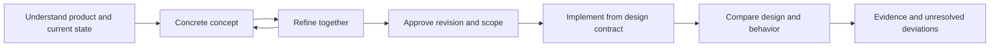

# stn-ultradesign: research foundation and design ambition

As of **September 16, 2026**. This independently developed skill supports comprehensive UI/UX audits, collaborative concept development and traceable implementation. It connects visual design, product workflows, business administration, web engineering and verification. Sources are linked in the specialist reports and the [skill's source register](../../skills/stn-ultradesign/references/sources.md).

## 1. What excellent contemporary design involves

A high-quality product helps its actual users complete tasks clearly, efficiently and reliably. That includes an intentionally designed interface and less visible decisions: permissions, data states, resumption, recovery, mobile input, domain correctness and performance under realistic conditions.

“Modern” therefore has several dimensions: current technical capabilities, suitable platform conventions, mature workflows, accessibility and a distinctive visual language. The year in which a visual style appeared is not evidence of quality. A new material effect can fit one product and harm readability or attention in another.

This project's ambition is high. Claims such as “the world's best skill,” “100 times better” or “5,000% improvement” would nevertheless require defined comparison tasks and credible results. The [evaluation procedure](../../skills/stn-ultradesign/references/skill-evaluation.md) explains how to test concrete advantages. This version documents actual checks separately from outstanding comparative and user studies.

## 2. Different sources carry different authority

| Source type | Useful contribution | Limitation |
| --- | --- | --- |
| Normative specifications | Testable requirements and defined terms | Scope and exceptions must be applicable |
| Official implementation documentation | Actual API, browser and library capabilities | Version-dependent; correct implementation is still necessary |
| Vendor design systems | Mature components and explicit design reasoning | Adapted to particular products and platforms |
| Original research and specialist authors | Explanatory models, studies and established heuristics | Not every rule of thumb has universal experimental support |
| Major providers' product documentation | Concrete roles, lifecycles and administration workflows | Different providers can have different, equally justified models |
| Public skills and demonstrations | Comparison of described capabilities | Scope, popularity and attractive examples do not establish superiority |

The skill distinguishes these levels. For example, WCAG 2.2 is a W3C Recommendation; ARIA examples support implementation; IBM's grid is a vendor design decision. Our method adds independently authored, verifiable working instructions. [WCAG](https://www.w3.org/TR/WCAG22/), [ARIA APG](https://www.w3.org/WAI/ARIA/apg/practices/read-me-first/), [Carbon Grid](https://carbondesignsystem.com/elements/2x-grid/overview/)

## 3. Design traditions reviewed

The research combines publicly accessible original publications by internationally influential practitioners. This selection is not a ranking and does not imply that their complete works were reviewed.

| Perspective | Authors included | Application to our work |
| --- | --- | --- |
| People, tasks and interaction | Don Norman, Eli Spencer, Jakob Nielsen, Ben Shneiderman, Bruce Tognazzini | Task understanding, status, control, error tolerance and concrete observation |
| Design care | Dieter Rams | Usefulness, clarity and deliberately justified design |
| Mobile use and input | Luke Wroblewski, Josh Clark | Prioritization, device context, input and comfortable reach |
| Systems and product development | Brad Frost, Julie Zhuo | Coherent components, real content and testable prototypes |
| Data and analytical reasoning | Tamara Munzner, Edward Tufte, Stephen Few, Mike Bostock | Domain questions, representation choice, comparison and implementation |

Specific claims, original sources and reading limits appear in the [expert report](experts.md). This combination does not prescribe one aesthetic. A laboratory dashboard, administration portal and public cultural application need not look alike.

## 4. Lessons from major design systems

The review covered Apple HIG, Material/Android, Microsoft Fluent, IBM Carbon, Adobe Spectrum, Atlassian, Salesforce SLDS, Shopify Polaris, AWS Cloudscape and Ant Design. The [platform report](platforms.md) documents 27 sources and retrieval status; some dynamic vendor pages were readable only through official indexed content.

Our synthesis is:

- **Layout follows tasks and available space.** Text size, input, multiple windows, content and working density matter alongside window width.
- **Hierarchy expresses relationships.** Typography, spacing, grouping, color, surfaces and motion should communicate consistent priorities.
- **Design rules form a system.** Roles for text, color, spacing, shapes, states and components need to work together.
- **Brand character and familiar interaction can coexist.** A distinctive interface does not need invented interaction logic for every standard task.
- **Adaptation preserves work.** Layout or device changes should preserve important information, state and task progress.
- **Trends require technical and domain fit.** Announcing a design language does not establish stable component support in every library.

The skill therefore prescribes no universal font family, single grid, global corner radius or blanket ban on particular colors. It requires a justified direction and checks its execution.

The [control and material research](liquid-glass-controls.md) archives a September 16, 2026 investigation of one requested design language. It is neither a skill default nor an automatically current specification for future projects. The [component state method](../../skills/stn-ultradesign/references/component-states.md) adds original cross-system acceptance criteria for everyday controls and their interaction states.

## 5. Account, organization, role and developer-interface UX

This is a dedicated area of the research. Business products often contain overlapping scopes: personal account, organization, project, resource, environment and sometimes customer or tenant. The product determines which actually exist; a small single-user tool does not need artificial enterprise administration.

The skill examines these interface questions:

| Area | Questions for the actual product |
| --- | --- |
| Personal settings | Does this change affect only me? Where are profile, notifications, language and my sign-in settings? |
| Organization administration | Who may invite members, change roles, manage policies and transfer ownership? |
| Projects and resources | Which permissions are inherited? Which exceptions apply? Is the current scope visible? |
| Billing | Are payment and contract permissions appropriately separated from technical administration? |
| Identity and provisioning | Which system governs membership and sign-in? What does the UI explain about SSO/SCIM conflicts and access removal? |
| API access | Who owns a key, and what purpose, scope, tenant and environment does it serve? |
| Webhooks | Which events go where? How are failure, retry, signing configuration and outcomes explained? |
| API documentation | Can a developer understand an operation and test it in the intended environment? |

There is deliberately no universal “administrators can do everything” model. Official product models from Atlassian, Google Cloud, Apple App Store Connect and Stripe provide different counterexamples. Sources and derived review scenarios appear in [business administration](business-administration.md) and [developer platforms](developer-platforms.md).

These are audits of legitimate account, access and integration **user experiences**, not instructions to obtain credentials or conduct penetration tests. UI inspection can identify misleading permission presentation. Claims about actual server enforcement require separately authorized implementation/API evidence; the skill keeps those claims distinct.

## 6. Complete audits with explicit coverage

An explicitly requested full audit covers every discovered page, component usage, widget, dialog, drilldown level and defined workflow in the agreed scope. This includes nested details, disclosures, role-dependent views, filters, tables, empty/error/loading states and return navigation.

Reconcile discovery against source code, the running application, navigation, feature configuration and documentation. Schema 2 connects entity relationships, finite contexts and planned obligations before results are recorded. Keep `pass`, `fail`, `blocked`, `not-tested` and `not-applicable` distinct, with appropriate evidence.

Review shared components centrally and in every actual usage context. Thousands of data rows may share one implementation, while different row types or renderers require separate coverage. Completeness concerns defined surfaces and relevant state transitions; infinitely many input strings or repeated loops do not create useful additional implementation coverage. Equivalent behavior classes need a documented basis.

Process large applications in resumable batches. Untested or inaccessible entries remain visible and prevent full completion. A reduced sample requires an explicitly agreed scope change and does not complete the originally requested full coverage.

The included validator checks the consistency of self-declared records, context plans, relationships and evidence methods. It does not run a browser audit, authenticate evidence or certify design quality. Even a completely investigated application can still contain defects. [Audit method](../../skills/stn-ultradesign/references/audit-method.md)

## 7. Agree the concept, then implement it faithfully

Before substantial design work, understand the actual product and its existing capabilities. The discovery process uses 20 tailored questions to clarify users, workflows, constraints and design preferences; answers already established by project evidence or the conversation should be carried forward. Distinguish standards and observed usability needs from owner preferences and unresolved hypotheses. A preference for a theme, language, density or visual direction must be recorded as a product decision rather than presented as a universal standard.

Maintain an explicit old-to-new feature map across the proposed redesign. Preserve existing actions, roles, states and user settings, including language, theme and density, unless a specific change is agreed. A cleaner-looking concept must not silently remove functionality. Trace each approved change into its concept, implementation and acceptance evidence. These discovery and feature-parity instructions strengthen the process; their effectiveness still requires a fresh independent application run.

Depending on scope, a concept includes actual views, information structure, workflows, copy, visual rules and significant states. Desktop, tablet and phone are described as coherent behavior, not merely three static screenshots. An isolated interactive prototype may be created before approval and remains clearly identified as a proposal.

Feedback produces a new concept revision. Approval refers to concrete artifacts and scope; it may approve some areas while leaving others open. Existing approval is respected rather than requested again without reason.

The design contract records fixed decisions and permitted flexibility. It supports observable acceptance criteria for structure, appearance, copy, behavior, permissions and adaptation. Unexpected material deviations require focused discussion instead of being silently treated as implementation details. [Concept workflow](../../skills/stn-ultradesign/references/concept-to-code.md)

## 8. What HTML, CSS and React must contribute

| Area | Why it matters to design quality |
| --- | --- |
| Semantic HTML | Interaction, structure and labels remain understandable across input methods |
| Intrinsic sizing, Grid, Flexbox, container queries | Real content fits available space, including widths between example resolutions |
| Design tokens and component contracts | Decisions remain consistent across views and states |
| Typography, assets and motion | The browser matches the concept while respecting preferences |
| React state and identity | Forms, focus, drafts and tenant changes retain appropriate continuity |
| Asynchronous data and errors | Loading, retry and saving represent actual outcomes |
| Visualization | Charts remain analytically correct and operable |
| Measurement and verification | Visual quality, task success, accessibility and performance receive separate evidence |

The specialist module explains concrete decisions and links HTML, React, MDN and testing documentation. It does not presume a new library or framework migration. Native applications additionally require their own platform APIs; web verification alone does not certify a native app. [Web engineering](../../skills/stn-ultradesign/references/web-engineering.md)

## 9. Video, existing skills and independent authorship

The linked uxpeak video was examined through its automatically generated English transcript. The interpretation appears in the [video and published-agent-guidance report](video-and-agent-guidance.md). It supplies a concrete starting point, not a universal standard or measured percentage improvement.

Current published material from OpenAI and Anthropic, plus UI UX Pro Max, Impeccable and Vercel Agent Skills on GitHub, was compared factually. Some already offer sophisticated concept and audit processes. It would be inaccurate to claim that all alternatives offer only superficial styling. [GitHub comparison](github-landscape.md)

No third-party skill files, command collections, templates, datasets, programs, images or logos are incorporated into `stn-ultradesign`. Text, procedures, test material and tools are independently authored. Technical claims use short paraphrases with source attribution. The [provenance notices](../../THIRD_PARTY_NOTICES.md) explain this boundary; they do not claim comprehensive legal review.

## 10. Use and continued quality development

The skill supports auditing, concept development, implementing approved concepts and focused improvements. A small requested fix should not expand into an unsolicited product rebuild.

A useful first application is a full audit of a clearly bounded product with authorized test roles and fixtures. Findings can inform a concrete concept, discussion and implementation. Then repeat the same tasks and acceptance checks. This produces project-specific evidence of improvement.

The published version is a developed and tested starting package with a transparent [quality status](../quality/evaluation.md). Actual failures should lead to targeted corrections. Additional rules are not an end in themselves; their value depends on whether the next application produces better, verifiable results.

See [Analytical experiences](analytical-experiences.md) for metric meaning, aggregation, comparison, freshness, thresholds and contextual exploration. These sources inform the analytical method; they do not establish a universal dashboard layout.

See [Task flow and proportion](task-flow-and-proportion.md) for discoverability, scoped search, contextual detail, pause/resume, navigation continuity and the empirical limits of golden-ratio claims. The [operational method](../../skills/stn-ultradesign/references/task-flow-design.md) requires a critical-task walkthrough before calling a concept ready; a label or placeholder cannot establish a completed workflow.

The [award-reference study](award-design-review.md) adds a provenance-labelled catalogue of 216 awarded projects. Seven selected catalogue entries and two additional industrial examples receive deeper document analysis. The report distinguishes award discovery from visual and interaction inspection, records selection bias, and turns reference observations into hypotheses to test rather than styles to copy.
