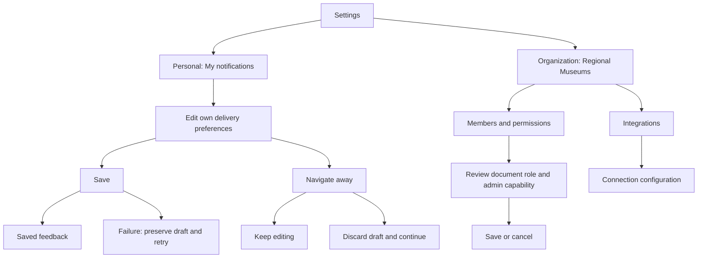

# Museum settings / v0.1

Status: **owner rejected the visual direction; revision required; not approved for production**. This preserved v0.1 is a development finding, not an endorsed example of design quality. The owner rated the visible concept 5/6 and criticized generic components, layout, arrangement, colors, forms, structure and workflow presentation. Open `index.html` to inspect the historical artifact. All people, integrations, status and changes are simulated. Reload resets the prototype. No external assets or services are used.

## Recommended concept

One settings area with two clearly named scopes: **Personal → My notifications**, and **Organization → Members & permissions / Integrations**. The active organization appears on every organization screen. Staff can understand whether a change affects just themselves or colleagues before touching a control.

This is a scoped settings concept, not an audit of a real application: no application source or existing screenshots were provided. The blue/white identity and system font are retained in principle; exact existing brand tokens must be mapped before implementation. The prototype uses an illustrative blue and generic product name, not a proposed rebrand.

## Inspect these interactions

1. Change a notification channel, save, and observe feedback.
2. Change another preference and navigate away: keep editing or discard the draft.
3. Enable **Simulate failed save**, save a changed value, and inspect preserved changes and recovery copy. Disable the simulation to retry.
4. Open **Members & permissions → Change**. Document role and organization management are separate controls. Cancel preserves current access; Save changes only synthetic state.
5. Switch the preview role to **Field curator**. Organization pages show an explanatory boundary; personal preferences remain available.
6. Open **Integrations → View configuration**. The detail identifies the organization, destination and event. It does not pretend to provide a working external connection.
7. Resize the browser: desktop uses a side navigation, tablet tightens the workspace, phone uses a compact section navigation and stacked member records. No hover-only interaction is needed.

## Proposed workflow map

## Assumptions to discuss

- Notifications belong to the individual within the current museum organization. If staff use several organizations, each can have different preferences.
- Curators submit and comment; approvers can make document decisions. Organization management is a separate capability and does not automatically grant document approval.
- Email and in-app alerts are supported. The daily summary and sample defaults are proposals, not existing behavior.
- The archive is an illustrative integration. No actual provider, credential model, payload, connection test or recovery workflow is known.
- Exact brand blue, existing role names and the application's actual save/API behavior are unavailable.

## Decisions requested for the next revision

1. Does the personal/organization split match how staff look for these settings?
2. Should notification preferences apply per museum organization, as proposed, or across the whole personal account?
3. Do document approval and organization administration need the proposed separate permissions?

These decisions are open, not assumed approved. The v0.1 scope available for approval is notification preferences, member-access editing, integration overview and the shown read-only configuration structure. Invitations, removal, ownership transfer, secrets, provider onboarding, disconnect, and the rest of the application are not designed or implicitly approved.

After discussion, update the contract and rendered artifact together. A clear approval of a specific revision and scope is needed before changing production code. This isolated prototype is already authorized by the exercise.
